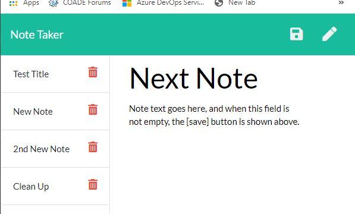

# Note Taker Project

Richard Ay, (October 2020, *updated March 2022*)

## Table of Contents
* [Project Objective](#project-objective)
* [Acceptance Criteria](#acceptance-criteria)
* [Technologies Used](#technologies-used)
* [Deployment Link](#deployment-link)
* [Note-Taker Logic](#note-taker-logic)
* [Application Screen Shot](#application-screen-shot)

## Project Objective
As a small business owner I want to be able to write and save notes
so that I can organize my thoughts and keep track of tasks I need to complete.

## Acceptance Criteria
Given a note-taking application

1) When I open the Note Taker
then I am presented with a landing page with a link to a notes page.

2) When I click on the link to the notes page
then I am presented with a page with existing notes listed in the left-hand column, plus empty fields to enter a new note title and the note’s text in the right-hand column.

3) When I enter a new note title and the note’s text
then a Save icon appears in the navigation at the top of the page.

4) When I click on the Save icon
then the new note I have entered is saved and appears in the left-hand column with the other existing notes.

5) When I click on an existing note in the list in the left-hand column
then that note appears in the right-hand column.

6) When I click on the Write icon in the navigation at the top of the page
then I am presented with empty fields to enter a new note title and the note’s text in the right-hand column.

## Technologies Used

* Node.js
* Express.js
* objects
* JSON 
* npm

## Deployment Link
This application is deployed on Heroku.  
The Heroku link is: https://notetaker-ay.herokuapp.com/

## Note-Taker Logic
The application logic is:

1) The main HTML page of the application is just an introductory page.  Clicking on the 'Get started' button brings up the HTML page where all the activity  is controlled.

2) When the 'activity page' loads, the 'get' route reads the  'db.json' file and existing note titles are displayed in the left hand page of the HTML page.

3) Clicking on an existing note title displays the title and note details on the right side of the page.

4) A 'pencil icon' at the upper right of the page header can be used to initialize the right side of the page to enable the definition of a new note.  When the text for a new note is defined, a 'disk icon' appears to facilitate saving the new note.

5) When the 'disk icon' is activated:
* the Math.random function is used to generate an ID number between 0 and 4999, for the new note,
* the new note is 'pushed' onto the end of the 'notes' array,
* the 'post' route rewrites all notes to the 'db.json' file,
* and the new note is added to the html list on the left hand side of the page.

6) When the delete (trash can icon) operation is invoked, the associated ID (of the selected note) is passed to the route and:
* the selected note is removed from the 'notes' array,
* the modified array is written to the 'db.json' file,
* the modified array is redisplayed on the left side of the HTML page.

## Application Screen Shot
